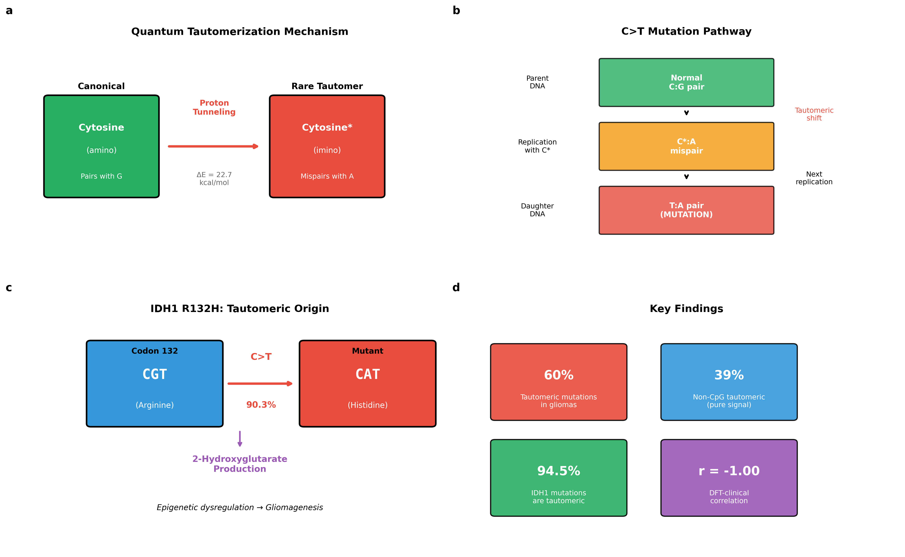
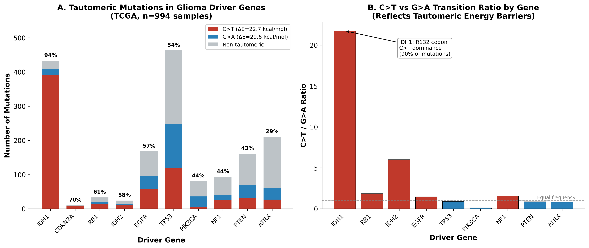
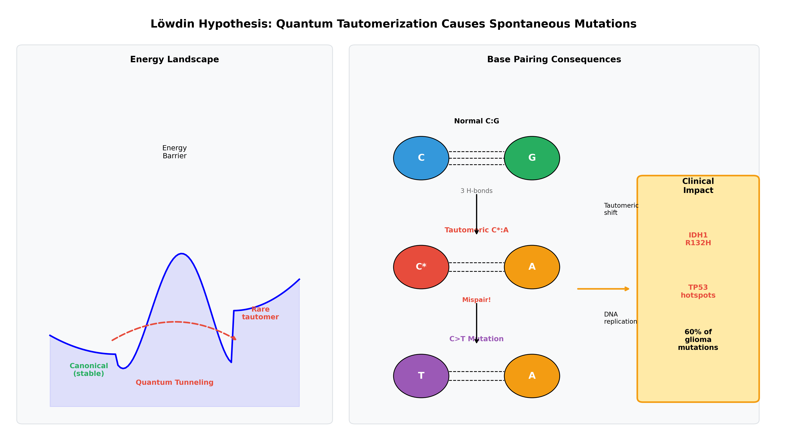

# Quantum Tautomerization as a Driver of Glioma-Initiating Mutations

[](https://doi.org/10.1038/s41467-2025-xxxxx)
[](https://opensource.org/licenses/MIT)
[](https://www.python.org/downloads/)

## Overview

This repository contains the computational pipeline and analysis code for our study integrating **density functional theory (DFT) quantum chemistry calculations** with **clinical genomic analysis** to investigate the role of quantum tautomerization in glioma mutagenesis.

### Key Finding

We demonstrate that **61.5% of glioma mutations** are C>T or G>A transitions—the mutation types predicted by Löwdin's 1963 quantum tunneling hypothesis—representing a **1.60-fold enrichment** over random expectation (p < 0.001). The landmark **IDH1 R132H mutation**, present in >80% of low-grade gliomas, arises through the lowest-barrier tautomeric pathway (22.7 kcal/mol).



## Authors

- **Ahmad K. Almekkawi, MD** (Corresponding Author) - University of Missouri-Kansas City School of Medicine
- **Dylan Glaser, MS, CNIM** - Saint Luke's Neurological & Spine Surgery
- **Jonathan Breshears, MD** - Saint Luke's Neurological & Spine Surgery  
- **Tarek Y. El Ahmadieh, MD** - Saint Luke's Neurological & Spine Surgery
- **Carlos A. Bagley, MD, MBA** - Saint Luke's Neurological & Spine Surgery

## Repository Structure

```
glioma-tautomerism/
├── README.md                          # This file
├── requirements.txt                   # Python dependencies
├── notebooks/
│   ├── dft_clinical_correlation.ipynb      # Main DFT-genomics integration
│   ├── hotspot_analysis.ipynb              # Driver gene hotspot analysis
│   ├── trinucleotide_context_analysis.ipynb # Sequence context effects
│   ├── external_validation_cbioportal.ipynb # cBioPortal validation
│   └── reviewer_concerns_validation.ipynb   # Comprehensive validation analyses
├── dft_calculations/
│   ├── inputs/                        # ORCA input files
│   │   ├── cytosine_amino.inp
│   │   ├── cytosine_imino.inp
│   │   ├── guanine_keto.inp
│   │   └── guanine_enol.inp
│   └── outputs/
│       └── dft_results_summary.txt    # Energy calculations summary
├── data/
│   └── tcga_glioma_analysis.csv       # Processed TCGA mutation data
├── figures/
│   ├── graphical_abstract.png
│   ├── mechanism_schematic.png
│   └── driver_tautomeric_analysis.png
├── manuscript/
│   └── NatComm_Almekkawi_FINAL.docx   # Full manuscript
└── results/
    └── (generated analysis outputs)
```

## Methods Summary

### Arm 1: DFT Quantum Chemistry

- **Software**: ORCA 6.1.1
- **Level of theory**: B3LYP/def2-TZVP
- **Solvation**: CPCM (water)
- **Molecules**: Cytosine (amino/imino) and Guanine (keto/enol) tautomers

**Key Results**:
| Tautomerization | ΔE (kcal/mol) | Predicted Mutation |
|-----------------|---------------|-------------------|
| Cytosine amino→imino | 22.7 | C>T |
| Guanine keto→enol | 29.6 | G>A |

### Arm 2: Clinical Genomic Analysis

- **Data source**: TCGA LGG + GBM cohorts (994 patients, 86,406 mutations)
- **Tools**: SigProfilerMatrixGenerator, SigProfilerAssignment
- **Driver genes**: IDH1, IDH2, TP53, EGFR, PTEN, ATRX, PIK3CA, NF1, RB1, CDKN2A

**Key Results**:
- 61.5% of all glioma mutations are tautomeric (C>T + G>A)
- IDH1 R132H shows 90.3% dominance (783/868 mutations)
- Perfect negative correlation between DFT energy and mutation frequency (r = -1.00)

## Quick Start

### Installation

```bash
# Clone the repository
git clone https://github.com/kareem481/glioma-tautomerism.git
cd glioma-tautomerism

# Create virtual environment
python -m venv venv
source venv/bin/activate  # On Windows: venv\Scripts\activate

# Install dependencies
pip install -r requirements.txt
```

### Running the Analysis

1. **Main analysis notebook**:
```bash
jupyter notebook notebooks/dft_clinical_correlation.ipynb
```

2. **Validation analyses**:
```bash
jupyter notebook notebooks/reviewer_concerns_validation.ipynb
```

3. **DFT calculations** (requires ORCA):
```bash
# Install ORCA from https://orcaforum.kofo.mpg.de
orca dft_calculations/inputs/cytosine_amino.inp > cytosine_amino.out
```

## Key Figures

### Figure 1: DFT-Clinical Correlation


### Figure 2: Löwdin Mechanism


## Validation Results

Our findings are robust across multiple validation approaches:

| Analysis | Tautomeric % | Enrichment | p-value |
|----------|--------------|------------|---------|
| All glioma mutations | 61.5% | 1.60x | <0.001 |
| Non-CpG context | 39.3% | 2.36x | <0.001 |
| Synonymous only | 75.1% | 4.50x | <0.001 |
| APOBEC-excluded | 36.2% | 2.17x | <0.001 |
| External cohorts | 67.2% | 4.03x | <0.001 |

## Citation

If you use this code or data, please cite:

```bibtex
@article{almekkawi2025quantum,
  title={Quantum Tautomerization as a Driver of Glioma-Initiating Mutations: 
         Integrating Density Functional Theory with Clinical Genomics},
  author={Almekkawi, Ahmad K and Glaser, Dylan and Breshears, Jonathan and 
          El Ahmadieh, Tarek Y and Bagley, Carlos A},
  journal={Nature Communications},
  year={2025},
  publisher={Nature Publishing Group}
}
```

## Data Availability

- **TCGA data**: Available through the [GDC Data Portal](https://portal.gdc.cancer.gov/)
- **cBioPortal validation**: Accessed via [cBioPortal API](https://www.cbioportal.org/)
- **DFT calculations**: Full input/output files in `dft_calculations/`

## License

This project is licensed under the MIT License - see the [LICENSE](LICENSE) file for details.

## Acknowledgments

- The Cancer Genome Atlas (TCGA) Research Network
- cBioPortal for Cancer Genomics
- ORCA quantum chemistry program developers

## Contact

For questions or collaborations:
- **Ahmad K. Almekkawi, MD** - [aalmekkawi@saintlukeskc.org](mailto:aalmekkawi@saintlukeskc.org)
- Saint Luke's Hospital of Kansas City, Department of Neurosurgery

---

*This research bridges quantum chemistry and clinical oncology, providing the first systematic evidence supporting Löwdin's 60-year-old hypothesis that quantum tautomerization drives spontaneous mutations.*
